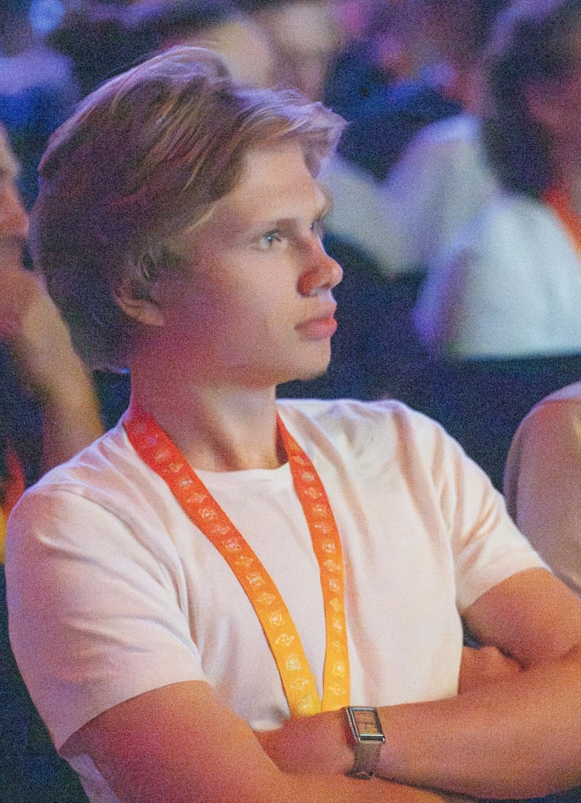

# Kirill Rybkov

Blockchain Developer & Mechatronics Enthusiast

<a href="kirill.rybkov@outlook.com">kirill.rybkov@outlook.com</a>
| <a href="https://www.linkedin.com/in/kirillrybkov/">LinkedIn</a>
| <a href="https://twitter.com/kirillrybkov">Twitter</a>
| <a href="https://github.com/Kirillr-Sibirski">GitHub</a>

## Profile

- Innovative and skilled <u>Software Developer</u> 
- with over two years of hands-on experience in 
- developing smart contracts and DeFi projects. 
- Proven track record of success in game 
- development and a strong passion for 
- mechatronics, electronics, and mechanics. 
- Adept at problem-solving and critical thinking, 
- with a knack for business and content creation.
  
- ---

## Skills

### Blockchain Development
- Solidity, Ethers.js, Remix, Foundry, web3.js, viem, wagmi

### Web Development
- Github, JavaScript, TypeScript, React.js, Next.js, Tailwind CSS

### Game Development
- C#, JavaScript

### Data Science
- Python, Matplotlib

### Electronics
- C/C++, Arduino, Sensors, Transistors, Motors, Raspberry Pi

### Design and Fabrication
- CAD (Onshape), 3D Printing (Creality Ender)

### Soft Skills
- Critical Thinking, Problem Solving, Public Speaking, Debating, Leadership, Teamwork, Organization

## Professional Experience

### Blockchain Developer
__Self-Employed, ETHGlobal__  
`2022 - Present`
- /-----------/
- <u>ETHGlobal Brussels</u>: Developed SCRBL in a team of 3, working as a backend developer utilizing Foundry to write and test smart contracts in Solidity. [Project Link](https://ethglobal.com/showcase/scrbl-6d9uh)
- <u>Smart Con Hacker House 2023</u>: Created DecentPort in a team of 2, serving as a backend developer and using Remix IDE to develop smart contracts. [Project Link](https://taikai.network/chainlink/hackathons/hackerhouse-sc23/projects/cln77ho7m004bvx0108a91vv1/idea)
- <u>ETHLisbon 2022</u>: Built Lekker Finance in a team of 4, working as a front-end developer and designer. Created the logo and contributed to the landing page and dashboard design using JavaScript, React.js, and Tailwind CSS. [Project Link](https://taikai.network/ethlisbon/hackathons/ethlisbon-2022/projects/cl9tpj350446301zcoiepyje5/idea) & [Website](https://lekker.finance/)
- Participated in various other online hackathons hosted by Gitcoin and ETHGlobal, developing projects such as:
  - <u>The Loan Stream</u>: [Project Link](https://ethglobal.com/showcase/the-loan-stream-vp2cc)
  - <u>Lukso Lending Protocol</u>: [Project Link](https://app.buidlbox.io/projects/llp?path=projects%2Fllp)
  - <u>newEnvAI</u>: [Project Link](https://github.com/Kirillr-Sibirski/newEnvAI)

### Founder
__CalmScent, BorderlessWave__  
`Feb 2023 - Aug 2023`
- /-----------/
- Established CalmScent, a dropshipping store specializing in oil diffusers sourced from China.
- Founded BorderlessWave, a Twitter management agency targeting tech startups in Seed/Series A funding rounds.

### Game Developer
__Freelance__  
`2021 - 2022`
- /-----------/
- Developed backend systems using C# and frontend systems using JavaScript.
- Created various game systems for online servers based on RAGE:MP API, a multi-player version of GTA5.

## Engineering Projects

### Active Suspension System for Preventing Rollovers in Off-Road Conditions
__Extended Project Qualification Artefact__  
`Oct 2023 - May 2024`
- /-----------/
- Developed an active suspension system implemented into a 
- 1/10th scale off-road RC model.
- Utilized 4 servo motors, an Arduino module, and an MPU6050 gyroscope.
- Wrote a PID algorithm to control the suspension system, enhancing programming skills in hardware devices.
- Authored a 6000-word research paper detailing the project. <a href="https://drive.google.com/file/d/1RVng1U3ozTkHGZV1VvMJidTT9ehvyb1P/view">EPQ Artefact Link</a>

## Additional Experience

### Delegate, UNWOMEN Council
__Barcelona International Model United Nations Conference__  
`April 2024`
- /-----------/
- Represented the delegation of Tanzania, debating at ESADE campus.
- Developed a strong understanding of politics and international relations.
- Enhanced debating and critical thinking skills. <a href="https://www.bimun.org/">Conference Link</a>

### Speaker, Public Speaking Event
__4Voices Public Speaking__  
`April 2024`
- /-----------/
- Delivered a talk on the future implications and risks of brainchips.
- Gained confidence in public speaking and clarity in presenting ideas.
- Discussed visionary ideas that address future challenges. <a href="https://4-voices.com/">Event Link</a>

### Participant, Barcelona Startup Conference
`April 2023`
- /-----------/
- Attended the conference to gain insights into startup funding in the EU.

### Business Bootcamp, ESEI Barcelona Business School
`June 2024`
- /-----------/
- Completed a business bootcamp to enhance entrepreneurial skills.

## Education

### High School
__The British School of Barcelona__  
`2021 - 2025`
- /-----------/
- <u>Engineering Society:</u> Discussed current problems in engineering.
- <u>Public Speaking Society:</u> Learned the importance of tone, stance, and eye contact in public speaking.
- <u>Duke of Edinburgh Bronze and Silver Awards:</u> Completed 2 and 3-day hikes respectively in the Catalonia region, developing resilience and the ability to overcome obstacles.
- <u>School Newspaper:</u> Contributed as one of the authors.
- <u>Green Team:</u> Assisted in constructing facilities for gardening and farming at the school.

### Secondary School
__El Limonar International School__  
`2018 - 2021`
- /-----------/

## Personal Projects and Hobbies

### Data Science Program for Analyzing Global Currencies

- Developed a Python program to analyze global currencies and attempt to create a digital currency representing the 'sum' of all world currencies.
- Utilized an algorithm to calculate the geometric mean of exchange rates to determine the price of the new digital currency.
- Conducted a detailed analysis, concluding that major currencies like USD, EUR, and GBP outperform others over time.

### Hobbies

- Rock climbing (bouldering) at around 6b+ level by Fontainebleau Grading System.
- Tinkering with metal and wood.
- Reading books, with favorites including "The Financier" by Theodore Dreiser, "The Space Barons" by Christian Davenport, and "Quantum Warrior: The Future of the Human Mind" by John Kehoe.
- Traveling: Visited Iceland, Morocco, Siberia, and most of Europe.
- Photography: <a href="https://www.behance.net/gallery/204270887/Portfolio/modules/1159344259">Portfolio</a>
